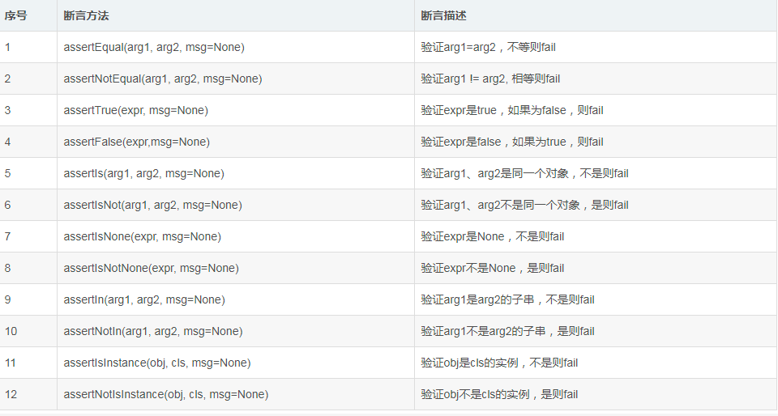

# python基础
## 1.字符串
+ 字符串大小写、拼接
+ 使用制表符、删除空白
+ 数字、整数、浮点数、函数str()
****
## 2.列表
+ 访问列表元素、添加删除修改元素
+ 组织列表，sort（）临时排序、永久排序
****
## 3.操作列表
+ 遍历整个列表
+ 使用range()函数创建数字列表
+ 列表解析 ``[value**2 for value in range(1,11)]``
+ 列表切片
+ 复制列表
+ 元组（200,500）
****
## 4.if 语句
+ 条件测试 
+ if-else语句
    + if-elif-else结构
****
## 5.字典
+ 使用字典，访问字典，添加、修改、删除键对值
+ 遍历字典
    + 遍历所有字典的键值对 items()
    + 遍历字典中所有的键 key
    + 遍历字典中所有的键 value
+ 嵌套
    + 字典嵌套列表
    + 字典嵌套字典
****
## 6.用户输入和while循环
+ 函数input()
    + int来获取整数
    + 求模运算（%）
+ while循环
    + break 退出循环
    + continue 跳出循环
+ 使用while循环处理字典与列表
    + pop() 删除移动元素
    + remove() 移动特定值的列表元素'
****
## 7.函数
+ 定义函数
    + 实参形参
    + 传递参数
    + 位置参数
    + 关键字实参
    + 默认值
    + 返回简单值 reuten
+ 传递列表
  + 在函数中修改列表 pop
  + 禁止函数修改列表 list_name[:]
+ 传递任意函数的实参
  + 位置参数和任意数量实参
  + 使用任意数量的关键字实参
+ 将函数存在模块中
## 8.类
+ 类与实例
+ 继承
****
## 9.文件与异常
+ 读取整个文件
  + 逐行读取
+ 异常
  + try-except 代码块
  + 处理文本
+ 存储数据
  + json.dump()、json.load()
****
## 10.测试代码
+ 单元测试与测试用列
+ 各种断言的方法

